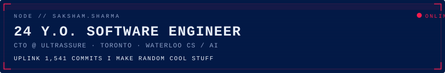
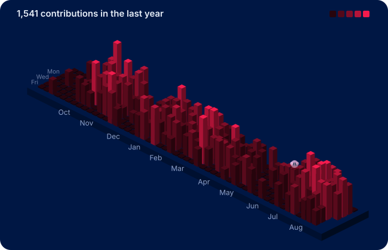
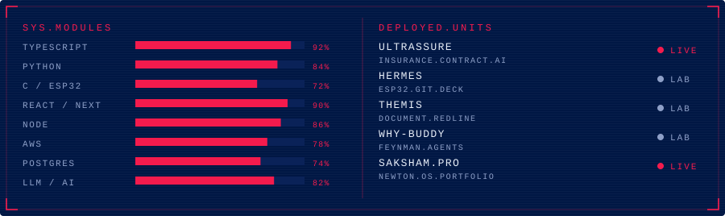

<div align="center">
  
</div>

<p align="center">
  24 y.o. software engineer ᕙ(`▿´)ᕗ<br/>
  I make random cool stuff — firmware on my desk, contract AI at work, weird side systems in between.
</p>

<p align="center">
  <a href="https://saksham.pro">saksham.pro</a>
  · <a href="https://ultrassure.com">ultrassure</a>
  · <a href="https://linkedin.com/in/saksham-uw">linkedin</a>
  · <a href="https://github.com/saksham-uw">github</a>
</p>

<div align="center">
  
</div>

<div align="center">
  
</div>

```
$ whoami
saksham // CTO @ Ultrassure, Waterloo CS (AI) alum, Toronto

$ ps aux | grep shipping
ultrassure   insurance contract intelligence     LIVE
hermes       ESP32 git deck                      LAB
themis       document redline engine             LAB
why-buddy    feynman study agents                LAB
portfolio    newton-os personal site             LIVE
```
